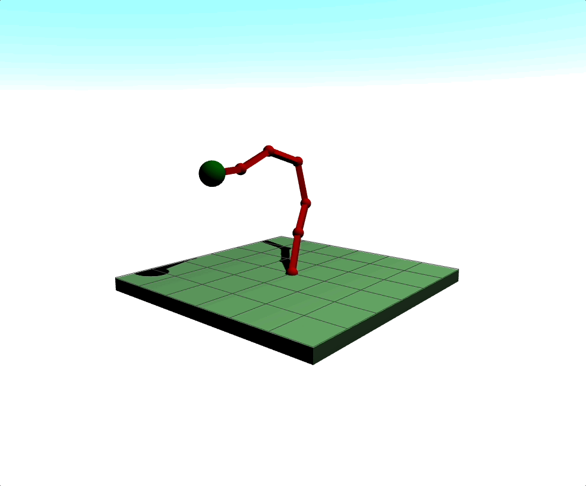
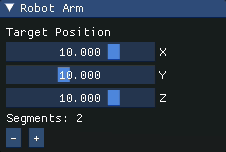

# Kinematics


# Table of contents

- [Overview](#overview)
- [Features](#features)
- [Installation and Setup](#installation-and-setup)
  - [1. Clone the repository](#1-clone-the-repository)
  - [2. Install Threepp](#2-install-threepp)
- [Usage](#usage)
- [Further improvement](#further-improvement)

## Overview
This is an object-oriented programming project that showcases the 3D movement of an robotic arm
in a 3D environment. Using the `threpp` library as a dependency, this project creates a 
scene where a robotic arm composed of multiple segments demonstrates inverse kinematics (IK)
principles, allowing the arm to reach a specified target represented as a green sphere. 

<p align="center">
  
</p>

## Features
* **3D Robotic Arm Simulation:** Simulates a robotic arm with desired number of segments
* **Inverse Kinematics Solver:** Implements an IK solver to move the arm 
towards target point using the [Cyclic Coordinates Descent](http://rodolphe-vaillant.fr/entry/114/cyclic-coordonate-descent-inverse-kynematic-ccd-ik)
approach (CCD IK)
* **Example:** Also includes an example of two boxes rotating. Found under examples/example/Example.cpp

## Installation and Setup
### 1. **Clone the repository:**
   ``` 
    git clone https://github.com/HermanGran/MappeEksamen_.git
   ```
### 2. **Install Threepp:**

#### Threepp
`Threpp` is a library which implements the [three.js](https://threejs.org) library from JavaScript
inside the C++ environment. 

#### Using threepp
As `vcpkg` is used, you need to tell CMake about it in order for dependency resolution to work:

`-DCMAKE_TOOLCHAIN_FILE=[path to vcpkg]/scripts/buildsystems/vcpkg.cmake`

###### Building under MinGW

Under MinGW you'll need to specify the vcpkg triplet:
```shell
-DVCPKG_TARGET_TRIPLET=x64-mingw-[static|dynamic]  # choose either `static` or `dynamic`.
-DVCPKG_HOST_TRIPLET=x64-mingw-[static|dynamic]    # <-- needed only if MSVC cannot be found. 
```

In order to update `threepp`, replace the baseline value in [vcpkg-configuration.json](vcpkg-configuration.json).
The baseline should point to a [commit](https://github.com/Ecos-platform/vcpkg-registry/commits/main)
from the [custom vcpkg registry](https://github.com/Ecos-platform/vcpkg-registry) that hosts the port.

## Usage
* **Launching the Robot Arm:** Run the Robot executable
* **Controlling the Arm:** Top left corner has the control for the target point and number of segments in the arm
* **Changing size:** You can change the size and length of each segment adjusting these values as shown under, and max number of segments found in src/robot/main.cpp
``` 
auto robotArm = std::make_shared<RobotArm>(size, length); 
Controls controls(canvas, orbitControls, maxNumSegments);
```

<p align="center">
  
</p>

## Further improvement
* Implement a draggable object as the target point
* Adjustable sizes and lengths of segments 
* Adjustable color for segments